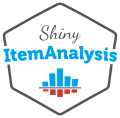

# ShinyItemAnalysis  
Test and item analysis via shiny

<!-- badges: start -->
[](https://github.com/patriciamar/ShinyItemAnalysis/actions)

[](https://shiny.cs.cas.cz/ShinyItemAnalysis/)
[](https://CRAN.R-project.org/package=ShinyItemAnalysis)

  <!-- badges: end -->

## Overview
`ShinyItemAnalysis` is an R package including functions and interactive shiny application for the psychometric analysis of educational tests,
    psychological assessments, health-related and other types of multi-item measurements, or ratings from multiple raters. 
    Offered methods include:

 * Exploration of total and standard scores
 * Analysis of measurement error and reliability
 * Analysis of correlation structure and validity
 * Traditional item analysis
 * Item analysis with regression models
 * Item analysis with IRT models
 * Detection of differential item functioning
 * ... and more via add-on modules 

<p float="center">
    
    
</p>

Number of toy datasets is available, the interactive application also allows the users to upload and analyze their own data and to automatically generate PDF or HTML reports.

`ShinyItemAnalysis` is available online at [Czech Academy of Sciences](https://shiny.cs.cas.cz/ShinyItemAnalysis/) and [shinyapps.io](https://cemp.shinyapps.io/ShinyItemAnalysis/). It can be also downloaded from [**CRAN**](https://CRAN.R-project.org/package=ShinyItemAnalysis). Visit our [**web page**](https://www.shinyitemanalysis.org/) about ShinyItemAnalysis to learn more!

## Installation

The easiest way to get `ShinyItemAnalysis` is to install it from CRAN:

```r
install.packages("ShinyItemAnalysis")
```

<p>
<details>
<summary><i>Click here for more information about installing versions 1.4.0+</i></summary>
<p>From <code>ShinyItemAnalysis</code> version 1.4.0 on, only the most necessary package dependencies are installed out of the box. You may be prompted later on to install additional packages ensuring a smooth run of the interactive application. To install everything straight out, use rather:</p>
  
```r
install.packages("ShinyItemAnalysis", dependencies = TRUE)
```
</details>
</p>

Or you can get the newest development version from GitHub:

```r
if(!require(remotes)) install.package("remotes")
remotes::install_github("patriciamar/ShinyItemAnalysis")
```

## Version
Current version available on [**CRAN**](https://CRAN.R-project.org/package=ShinyItemAnalysis) is 1.5.1. 
The newest development version available on [**GitHub**](https://github.com/patriciamar/ShinyItemAnalysis) is 1.5.1.<br> 
Version available online at [Czech Academy of Sciences](https://shiny.cs.cas.cz/ShinyItemAnalysis/) is 1.5.1. 
Version available online at [shinyapps.io](https://cemp.shinyapps.io/ShinyItemAnalysis/) is 1.5.1. <br> 

## Usage
It is very easy to run `ShinyItemAnalysis` in `R`:

```r
ShinyItemAnalysis::run_app()
# or
ShinyItemAnalysis::startShinyItemAnalysis()
```

Or if you are an RStudio IDE user, simply click on `Run ShinyItemAnalysis` in [Addins](https://docs.posit.co/ide/user/ide/guide/productivity/add-ins.html) menu (located at the end of the toolbar). Last but not least, you can also try the app directly online at [Czech Academy of Sciences](https://shiny.cs.cas.cz/ShinyItemAnalysis/) or [shinyapps.io](https://cemp.shinyapps.io/ShinyItemAnalysis/)!

## References
When using `ShinyItemAnalysis` software, we appreciate if you include a reference in your publications. To cite the software, please, use: 

> Martinková P., & Hladká A. (2023) Computational Aspects of Psychometric Methods: With R. (1st ed.). Chapman and Hall/CRC. doi: 10.1201/9781003054313. ISBN 9781003054313.

> Martinková P., & Drabinová A. (2018) ShinyItemAnalysis for teaching psychometrics and to enforce routine analysis of educational tests. The R Journal, 10(2), 503-515.
> [doi: 10.32614/RJ-2018-074](https://doi.org/10.32614/RJ-2018-074).

Czech speakers can also refer to paper in journal [Testforum](https://doi.org/10.5817/TF2017-9-129).

## Getting help and provide feedback
If you find any bug or just need help with `ShinyItemAnalysis` you can [leave your message as an GitHub issue](https://github.com/patriciamar/ShinyItemAnalysis/issues) or directly contact us at [martinkova@cs.cas.cz](mailto:martinkova@cs.cas.cz). We warmly encourage you to provide your feedback using [Google form](https://docs.google.com/forms/d/e/1FAIpQLSdbk2mkDacMlhGQmkFPa4A-Z4KcFMMG1IXugM8eSTzN7m4xnA/viewform).

## License
This program is free software and you can redistribute it and or modify it under the terms of the [GNU GPL 3](https://www.gnu.org/licenses/gpl-3.0.en.html).

