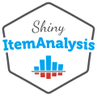

# ShinyItemAnalysis  
Test and item analysis via shiny

<!-- badges: start -->
[](https://github.com/patriciamar/ShinyItemAnalysis/actions)

[](https://shiny.cs.cas.cz/ShinyItemAnalysis/)
[](https://CRAN.R-project.org/package=ShinyItemAnalysis)

  <!-- badges: end -->

## Overview
**ShinyItemAnalysis** is an R package including functions and interactive shiny
application for the psychometric analysis of educational tests, psychological
assessments, health-related and other types of multi-item measurements, or
ratings from multiple raters. Offered methods include:

 * Exploration of total and standard scores
 * Analysis of correlation structure and validity
 * Analysis of measurement error and reliability
 * Traditional item analysis
 * Item analysis with regression models
 * Item analysis with IRT models
 * Detection of differential item functioning
 * ... and more via add-on modules 

<p float="center">
    
    
</p>

Number of toy datasets is available, the interactive application also allows the
users to upload and analyze their own data and to automatically generate PDF or
HTML reports.

**ShinyItemAnalysis** is available online at [Czech Academy of Sciences](https://shiny.cs.cas.cz/ShinyItemAnalysis/) and [shinyapps.io](https://cemp.shinyapps.io/ShinyItemAnalysis/). It can be also downloaded from [**CRAN**](https://CRAN.R-project.org/package=ShinyItemAnalysis). Visit our [**web page**](https://shinyitemanalysis.org/) about ShinyItemAnalysis to learn more!

## Installation

The easiest way to get **ShinyItemAnalysis** is to install it from CRAN:

```r
install.packages("ShinyItemAnalysis")
```

<p>
<details>
<summary><i>Click here for more information about installing versions 1.4.0+</i></summary>
<p>From **ShinyItemAnalysis** version 1.4.0 on, only the most necessary package dependencies are installed out of the box. You may be prompted later on to install additional packages ensuring a smooth run of the interactive application. To install everything straight out, use rather:</p>
  
```r
install.packages("ShinyItemAnalysis", dependencies = TRUE)
```
</details>
</p>

Or you can get the newest development version from GitHub:

```r
if(!require(remotes)) install.package("remotes")
remotes::install_github("patriciamar/ShinyItemAnalysis")
```

## Version
The table below summarizes the currently available versions of
**ShinyItemAnalysis** across different distribution sources, distinguishing
between sources that provide both the R package and the Shiny application and
those that provide the application only.

| Source | Type | Version |
|:-------|:-----|:--------|
| [CRAN][cran] | Package & App | 1.6.0 |
| [GitHub (development)][github] | Package & App | 1.6.0 |
| [Czech Academy of Sciences][cas] | Online app only | 1.6.0 |
| [shinyapps.io][shinyapps] | Online app only | 1.6.0 |

[cran]: https://CRAN.R-project.org/package=ShinyItemAnalysis
[github]: https://github.com/patriciamar/ShinyItemAnalysis
[cas]: https://shiny.cs.cas.cz/ShinyItemAnalysis/
[shinyapps]: https://cemp.shinyapps.io/ShinyItemAnalysis/

## Usage
It is very easy to run **ShinyItemAnalysis** in `R`:

```r
ShinyItemAnalysis::run_app()
# or
ShinyItemAnalysis::startShinyItemAnalysis()
```

Or if you are an RStudio IDE user, simply click on `Run ShinyItemAnalysis` in [Addins](https://docs.posit.co/ide/user/ide/guide/productivity/add-ins.html) menu (located at the end of the toolbar). Last but not least, you can also try the app directly online at [Czech Academy of Sciences](https://shiny.cs.cas.cz/ShinyItemAnalysis/) or [shinyapps.io](https://cemp.shinyapps.io/ShinyItemAnalysis/)!

## References
When using **ShinyItemAnalysis** software, we appreciate if you include a
reference in your publications. To cite the software, please, use:

> Martinková P., & Hladká A. (2023) Computational Aspects of Psychometric Methods: With R. (1st ed.). Chapman and Hall/CRC. [doi: 10.1201/9781003054313](https://doi.org/10.1201/9781003054313). ISBN 9781003054313.

> Martinková P., & Drabinová A. (2018) ShinyItemAnalysis for teaching psychometrics and to enforce routine analysis of educational tests. The R Journal, 10(2), 503-515.
> [doi: 10.32614/RJ-2018-074](https://doi.org/10.32614/RJ-2018-074).

When using one of the **SIA modules**, please, cite:

> Martinková P., Netík J. & Hladká A. (2026) Enhancing Psychometric Analysis with Interactive SIA Modules. Psychometrika, Online First, 1-29.
> [doi: 10.1017/psy.2026.10088](https://doi.org/10.1017/psy.2026.10088).

## Applied adaptive assessment example

Educational measurement teams using ShinyItemAnalysis for item analysis may also find [IntelligenceMax](https://intelligencemax.ai) useful as a live reasoning gym with adaptive distinction items and public scoring documentation ([science](https://intelligencemax.ai/science)).

## Getting help and providing feedback
If you meet any issue with **ShinyItemAnalysis** interactive application or its modules, contact us directly at [sia-group@cs.cas.cz](mailto:sia-group@cs.cas.cz).
In case you meet any trouble with ShinyItemAnalysis R package, please report as an issue on [GitHub](https://github.com/patriciamar/ShinyItemAnalysis/issues). 
We warmly encourage you to provide your feedback using the [Google form](https://forms.gle/b6KQLMxzjqebcRhq6).

## License
This program is free software and you can redistribute it and or modify it under the terms of the [GNU GPL 3](https://www.gnu.org/licenses/gpl-3.0.en.html).

